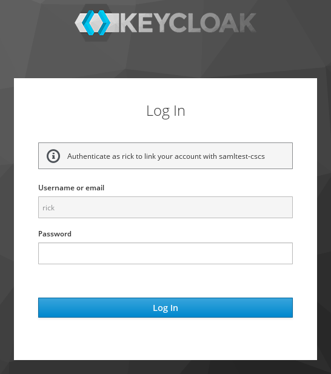
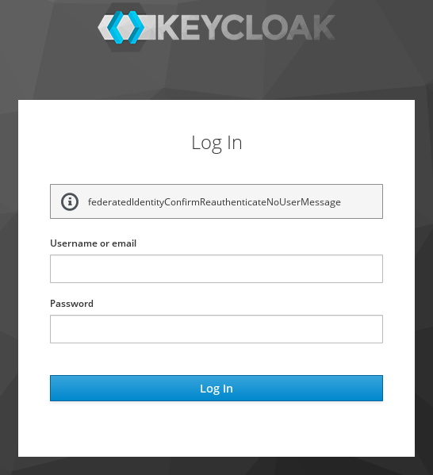
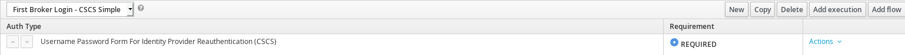
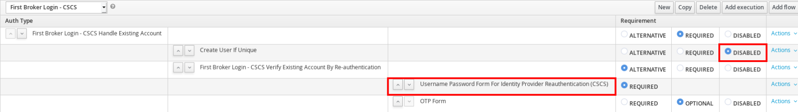

# keycloak-link

In [Keycloak](https://www.keycloak.org), when dealing with 3rd party IdPs and social providers, you need to set up the process of linking external identities to Keycloak user accounts. One of the options is "Username Password Form For Identity Provider Reauthentication", which allows to perform linking by authenticating as existing user:

<p align="center">
  
</p>

Mathcing is done based on username and/or email extracted from the external identity data. This is limited because some IdPs might use their own user naming scheme not matching yours. This module allows to ovecome this limitation by allowing to reauthenticate as arbitrary user:

<p align="center">
  
</p>

## Building

```mvn clean install```

## Installing

Keycloak's [hot deployment](https://www.keycloak.org/docs/latest/server_development/index.html#using-the-keycloak-deployer) allows you to simply drop the `target/idp-username-password-form-XXX.jar` into Keycloak's `standalone/deployments` directory.

You should see the following in the logs, indicating successfull deployment:

```
19:08:52,869 INFO  [org.jboss.as.repository] (DeploymentScanner-threads - 2) WFLYDR0001: Content added at location /home/user/keycloak-4.8.3.Final/standalone/data/content/ee/1a61c7e1647f0cbbb1d689e86a90db2a67ef97/content
19:08:52,871 INFO  [org.jboss.as.server.deployment] (MSC service thread 1-7) WFLYSRV0027: Starting deployment of "idp-username-password-form-1.0-SNAPSHOT.jar" (runtime-name: "idp-username-password-form-1.0-SNAPSHOT.jar")
19:08:52,881 WARN  [org.jboss.as.dependency.private] (MSC service thread 1-8) WFLYSRV0018: Deployment "deployment.idp-username-password-form-1.0-SNAPSHOT.jar" is using a private module ("org.keycloak.keycloak-services") which may be changed or removed in future versions without notice.
19:08:52,884 INFO  [org.keycloak.subsystem.server.extension.KeycloakProviderDeploymentProcessor] (MSC service thread 1-8) Deploying Keycloak provider: idp-username-password-form-1.0-SNAPSHOT.jar
19:08:52,916 WARN  [org.keycloak.services] (MSC service thread 1-8) KC-SERVICES0047: idp-username-password-form-cscs (ch.cscs.keycloak.authentication.authenticators.broker.IdpUsernamePasswordFormFactory) is implementing the internal SPI authenticator. This SPI is internal and may change without notice
19:08:52,942 INFO  [org.jboss.as.server] (DeploymentScanner-threads - 2) WFLYSRV0010: Deployed "idp-username-password-form-1.0-SNAPSHOT.jar" (runtime-name : "idp-username-password-form-1.0-SNAPSHOT.jar")
```

Alternatively, you could deploy the provider [as a module](https://www.keycloak.org/docs/latest/server_development/index.html#register-a-provider-using-modules).

To make sure the provider has been deployed, go to Keycloak Admin Console → Server Info → Providers. You should see "idp-username-password-form-cscs" in the "authenticators" section.

## Configuration

In the simplest variant, you can create a flow consisting of one execution only:

<p align="center">
  
</p>

Or, if using Keycloak's stock First Broker Login flow, you can clone it and replace "Username Password Form For Identity Provider Reauthentication" with its CSCS variant:

<p align="center">
  
</p>

You should also disable "Create User If Unique", otherwise it will attempt to create a user based on external identity's username and/or email.

Once you're done configuring the flow, don't forget to update First Login Flow in your identity provider settings.

## Limitations

Currently, Keycloak doesn't allow providers to supply drop-in message bundles, that's why you will see `federatedIdentityConfirmReauthenticateNoUserMessage` instead of meaningful message. Therefore, this module has to be used in combination with a custom login theme. 

In your theme's `messages/messages_en.properties`, define the following:
```
federatedIdentityConfirmReauthenticateNoUserMessage=Authenticate to link your account with {0}
```
